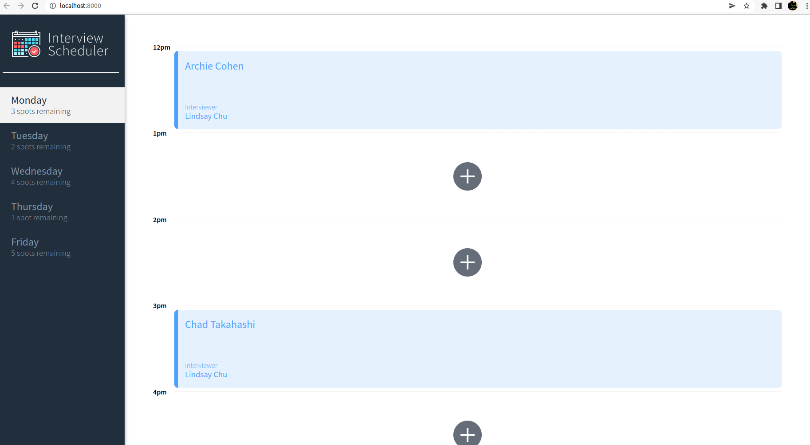
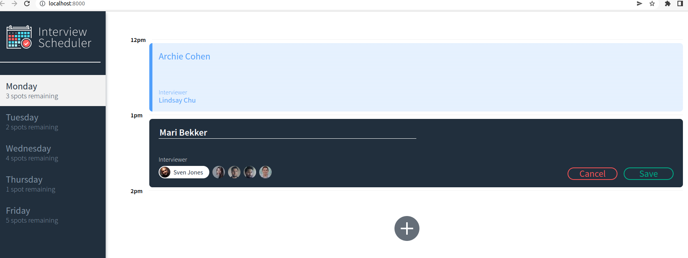
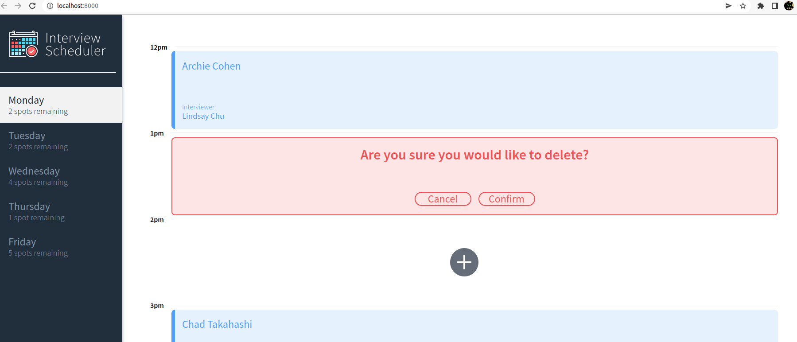

# Interview Scheduler

A react learning app where a user is able to select any day and book an interview with a list of available instructors. 

## Setup

Install dependencies with `npm install`.

## Running Webpack Development Server

```sh
npm start
```

## Running Jest Test Framework

```sh
npm test
```

## Running Storybook Visual Testbed

```sh
npm run storybook
```
## Screenshots





